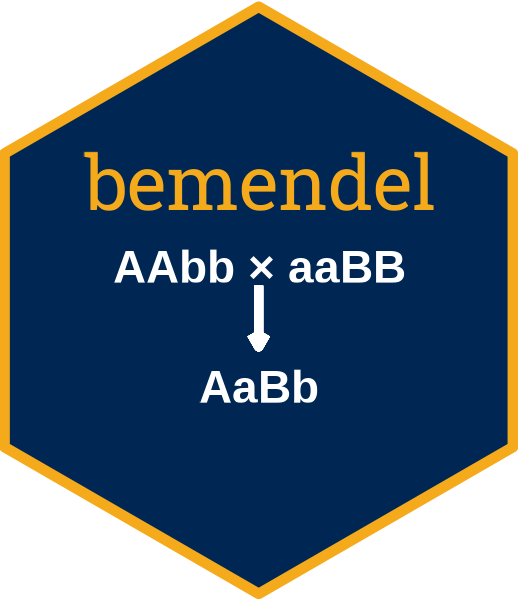
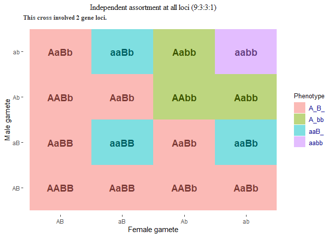
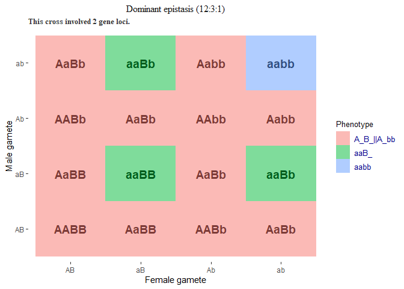

<!-- README.md is generated from README.Rmd. Please edit that file -->

# bemendel 

<!-- badges: start -->

[](https://app.codecov.io/gh/awkena/bemendel?branch=master)
[](https://github.com/awkena/bemendel/actions/workflows/test-coverage.yaml)
<!-- badges: end -->

# Practice Mendelian Genetics in R

**`bemendel`** can be used as a teaching and learning tool to
demonstrate some of the basic concepts of classical genetics. It
features both customizable functions and a user-friendly Shiny app to
make and visualize genetic crosses in R.

In the current development version, the package can do the following:

- Takes user input of strings as genotypes for parents

- Uses the inputted parental genotype information to determine whether
  the loci are heterozygous or homozygous for the alleles.

- Uses the inputted parental genotype information to generate the
  possible unique gamete(s) each parent can produce.

- Enables the user to make a cross between the parents to generate a
  Punnett square containing the genotypes of all progenies ensuing from
  the cross.

- Gives a summary of the unique genotypes in the Punnett square and
  their expected genotype frequencies.

- Assuming complete dominance at each locus, the app allows users to
  visualize hypotheses about gene interactions and their phenotypic
  predictions.

- Specifically, the app uses different colors to highlight individuals
  in the Punnett square that would exhibit the same phenotype under a
  given gene interaction hypothesis.

- Currently, phenotypic predictions for gene interaction hypotheses on
  independent assortment and classical digenic epistatic interactions
  can be visualized.

Submit bug reports and feature suggestions, or track changes on the
[issues page](https://github.com/awkena/bemendel/issues).

# Table of contents

- [Requirements](#requirements)
- [Recommended packages](#recommended-packages)
- [Installation](#installation)
- [Example](#usage)
  - [Launch the Shiny app](#launch-the-shiny-app)  
  - [Make genetic crosses in R](#make-genetic-crosses-in-r)
  - [Visualize phenotypic predictions in
    R](#visualize-phenotypic-predictions-in-r)
    - [Independent assortment
      hypothesis](#independent-assortment-hypothesis)
    - [Classical digenic epistatic gene interaction
      hypothesis](#classical-digenic-epistatic-gene-interaction-hypothesis)
- [Troubleshooting](#troubleshooting)
- [Authors](#authors)
- [License](#license)
- [Support and Feedback](##support-and-feedback)

# Requirements

To run this package locally on a machine, the following R packages are
required:

- [argonDash](https://rinterface.github.io/argonDash/): Argon Shiny
  Dashboard Template

- [argonR](https://cran.r-project.org/package=argonR): R Interface to
  Argon HTML Design

- [reactable](https://glin.github.io/reactable/): Interactive data
  tables for *R*, based on the React Table JavaScript library

- [shiny](https://shiny.rstudio.com/): Makes it incredibly easy to build
  interactive web applications with *R*

- [shinyjs](https://deanattali.com/shinyjs/): Easily improve the user
  experience of your Shiny apps in seconds

- [reshape2](http://www.jstatsoft.org/v21/i12/): Reshaping Data with the
  reshape Package

- [htmltools](https://CRAN.R-project.org/package=htmltools): Tools for
  HTML

- [bubbles](https://rdrr.io/github/jcheng5/bubbles/):d3 Bubble Chart
  htmlwidget

- [ggplot2](https://ggplot2.tidyverse.org): Elegant Graphics for Data
  Analysis

- [tools](https://www.rdocumentation.org/packages/tools/versions/3.6.2):
  Tools for package development, administration and documentation.

# Recommended packages

- [Rtools](https://cran.r-project.org/bin/windows/Rtools/rtools43/rtools.ht%20ml):
  Needed for package development.

- [rmarkdown](https://CRAN.R-project.org/package=rmarkdown): When
  installed, display of the project’s README.md help will be rendered
  with R Markdown.

# Installation

You can install the development version of **`bemendel`** from
[GitHub](https://github.com/) with:

``` r
# install.packages("devtools")
devtools::install_github("awkena/bemendel")
```

Once the installation is done, you can load the package by entering the
following command in the console:

``` r
library(bemendel)
```

# Example

The package offers two user-centered options for usage: the Shiny app
version and the use of customizable functions in R.

The Shiny app version is intended for easy use or demonstration in the
classroom to students, whereas the customizable functions are for
beginner or intermediate R users.

## Launch the Shiny app

The user-friendly Shiny app for bemendel can be launched by running this
code:

``` r
library(bemendel)

## Launch the Shiny app version
bemendel::run_app()
```

**Running the above code will open the `bemendel` web app in your
default browser for usage.**

It takes very simple steps to use the app to make and visualize genetic
crosses.

1.  Enter the genotypes of the maternal and paternal parents.  
2.  Enter letters of the English alphabets only.
3.  Use a single letter to represent each allele at a locus.
4.  Do not mix letters with numbers to represent an allele at any locus.
5.  Inputted parental genotypes must be in multiples of two letters.
6.  Click on the **`Cross parents`** button to see the gametes of the
    parents and Punnett square.
7.  To view phenotypic predictions, click on the **`Phenotype`** tab
    -\>\> select the gene interaction hypothesis -\>\> click on the
    **`View phenotypes`** button.

## Make genetic crosses in R

To generate a genetic cross in R between two parents, use the `do_pun()`
function as shown below:

``` r
library(bemendel)
# Generate punnett square for a dihybrid cross
# Maternal genotype = "AaBb", and paternal genotype = "AaBb"
pun1 <- do_pun(female.geno = "AaBb", male.geno = "AaBb")

# Get punnett square
pun1$punnett_square 
#>      AB   aB   Ab   ab
#> AB AABB AaBB AABb AaBb
#> aB AaBB aaBB AaBb aaBb
#> Ab AABb AaBb AAbb Aabb
#> ab AaBb aaBb Aabb aabb

# Get summary of progeny genotypes
pun1$pun_summary 
#>   progeny nobs pop_size   freq
#> 1    AABB    1       16 0.0625
#> 2    AABb    2       16 0.1250
#> 3    AAbb    1       16 0.0625
#> 4    AaBB    2       16 0.1250
#> 5    AaBb    4       16 0.2500
#> 6    Aabb    2       16 0.1250
#> 7    aaBB    1       16 0.0625
#> 8    aaBb    2       16 0.1250
#> 9    aabb    1       16 0.0625
```

The do_pun() function returns two objects: the Punnett square for the
genetic cross made, and a tabular summary of the progeny genotypes in
the Punnett square.

The summary table shows the unique progeny genotypes and their
respective genotype frequencies in the Punnett square.

## Visualize phenotypic predictions in R

### Independent assortment hypothesis

To visualize phenotypic predictions for the hypothesis that there is
independent assortment of genes and complete dominance at both loci, use
the `pun_plot()` function.

The `pun_plot()` function uses a melted data frame of the Punnett square
to make a plot of the genotypes by coloring genotypes that would exhibit
the same phenotype under the given hypothesis.

The `pun2df()` function can be used to melt the Punnett square into a
long format data frame for plotting.

``` r
# Melt Punnett square to long data frame
long_df <- pun2df(pun1$punnett_square)

# Visualize phenotypic groups based on independent assortment hypothesis
pun_plot(pun2df = long_df, text_size = 10, epistasis = FALSE)
```



### Classical digenic epistatic gene interaction hypothesis

Five (5) classical digenic epistatic gene interactions are currently
implemented.

To visualize phenotypic predictions for classical digenic epistatic gene
interaction hypothesis, use the `epist()` function to specify the type
of digenic epistasis hypothesis.

``` r
# Digenic epistasis -- Dominant epistasis (DE) hypothesis
epi_de <- epist(female.geno = "AaBb", male.geno = "AaBb", type = "DE")

head(epi_de)
#>   Var1 Var2 geno phenotype  epistasis epi_type
#> 1   AB   AB AABB      A_B_ A_B_||A_bb       DE
#> 2   aB   AB AaBB      A_B_ A_B_||A_bb       DE
#> 3   Ab   AB AABb      A_B_ A_B_||A_bb       DE
#> 4   ab   AB AaBb      A_B_ A_B_||A_bb       DE
#> 5   AB   aB AaBB      A_B_ A_B_||A_bb       DE
#> 6   aB   aB aaBB      aaB_       aaB_       DE

# Visualize phenotypic predictions based on dominant epistatic gene action hypothesis
pun_plot(pun2df = epi_de, text_size = 10, epistasis = TRUE)
```



# Troubleshooting

If the app does not run as expected, check the following:

- Was the package properly installed?

- Were any warnings or error messages returned during package
  installation?

- Do you have the required dependencies installed?

- Are all packages up to date?

# Authors

- [Alexander Wireko Kena](https://www.github.com/awkena)

- [Geoffrey Preston
  Morris](https://www.morrislab.org/people/geoff-morris)

# License

[GNU GPLv3](https://choosealicense.com/licenses/gpl-3.0/)

# Support and Feedback

For support and submission of feedback, email the maintainer **Alexander
Kena, PhD** at <alex.kena24@gmail.com>
